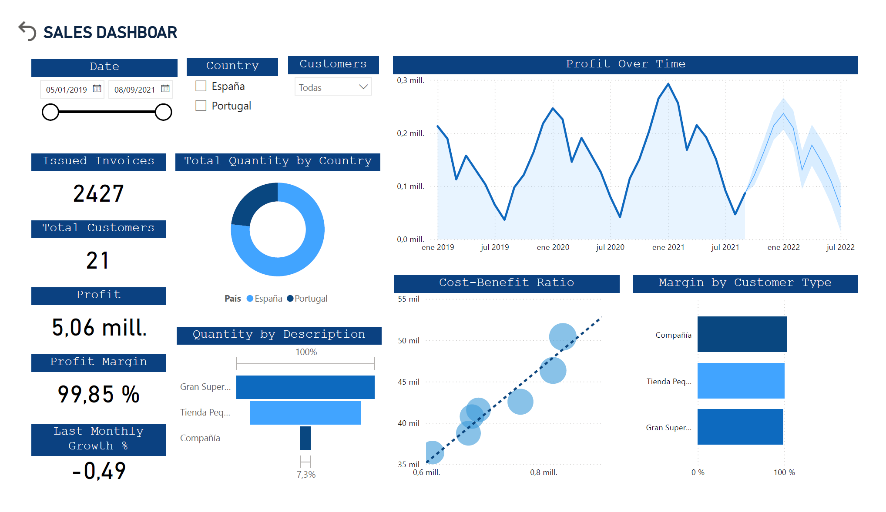

# 📊 Power BI Sales Dashboard

This project showcases a business-oriented Power BI dashboard built on a structured dataset of sales transactions. The goal is to simulate a real-world scenario where key performance indicators (KPIs) help decision-makers understand trends, identify high-performing regions and products, and explore business efficiency.

---

## 🎯 Project Objective

The dashboard is designed to answer core business questions such as:

- Which regions generate the highest revenue?
- What are the top-selling and most profitable products?
- How do monthly sales evolve over time?
- Where can operational efficiency be improved?

This project demonstrates how visual analytics can support commercial strategy and performance tracking.

---

## 📊 Key Features

- **Sales and Profit Over Time**: Monthly trend analysis.
- **Regional and Country Breakdown**: Profit distribution across geographies.
- **Product-Level Insights**: Quantity sold by product type.
- **Efficiency Analysis**: Comparing cost vs. profit visually.
- **Interactive Filters**: Slicers for region, product, and date.
- **Clean and Business-Ready Design**.

DAX measures were used to compute custom KPIs and support dynamic visualizations.

---

## 📁 Files Included

- `sales-dashboard.pbix`: Editable Power BI report.
- `sales-dashboard.pdf`: Exported version for quick preview.
- `Database.xlsx`: Structured dataset used for the dashboard.

---

## 🧱 Dataset & Model

The dataset is pre-cleaned and structured, including fields such as:

- Order Date
- Product Description & Category
- Region and Country
- Units Sold, Revenue, Cost, Profit

A simple data model was created in Power BI using relationships between the tables and custom DAX measures to enable key calculations.

---

## 🧠 Notes

This dashboard was created as part of a self-learning initiative focused on building strong business data stories using BI tools. While the dataset required no transformation, the focus was on clear KPIs, professional visual layout, and analytical thinking — essential for any entry-level data analyst or data scientist.

---

## 📬 Contact

📧 israelddh@hotmail.com  
🔗 [LinkedIn](https://www.linkedin.com/in/israel-duarte/)  
🆔 [ORCID Profile](https://orcid.org/0000-0001-5427-6019)  

